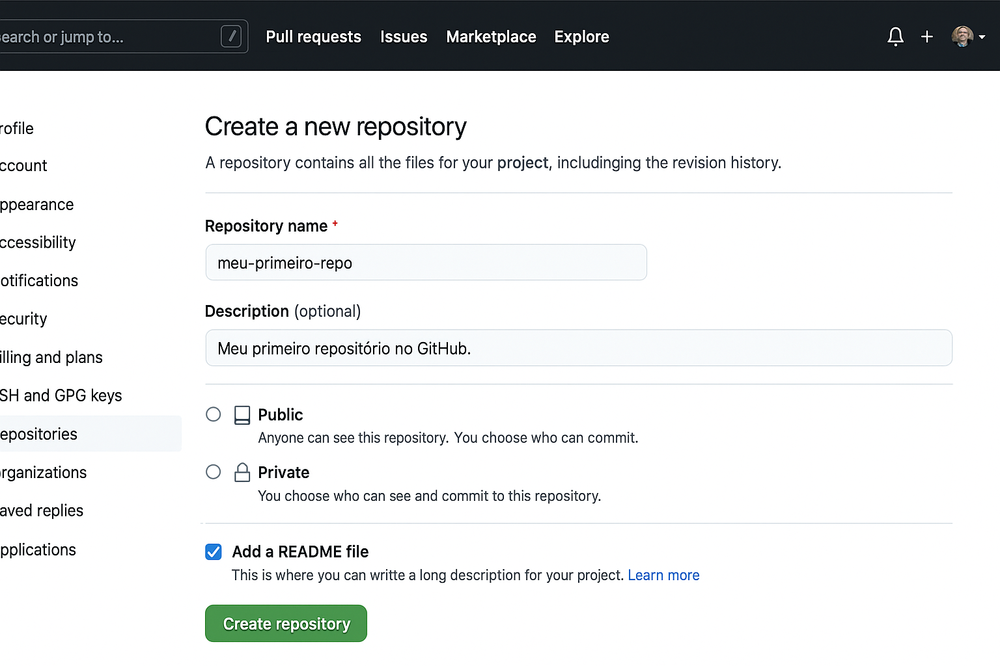

# Meu Primeiro Repositório no GitHub

## 🎯 Objetivo

Aprender o básico do GitHub em grupo, incluindo:

-   Criar um repositório
-   Convidar colaboradores
-   Criar branches
-   Fazer commits
-   Abrir Pull Requests
-   Revisar e aprovar alterações

---

## 👥 Papéis

-   **Dev1** → cria o repositório, convida Dev2 e Dev3, revisa e aprova PRs.
-   **Dev2** → cria a branch **dev2**, faz alterações e abre PR.
-   **Dev3** → cria a branch **dev3**, faz alterações e abre PR.

---

## **1️⃣ Dev1 – Criar repositório e convidar**



1. No GitHub, clique **New Repository**.
2. Nome: `meu-primeiro-repo` → Público → Add README.
3. Clique **Create repository**.
4. Vá em **Settings → Collaborators → Add people**.
5. Digite o usuário do **Dev2** → **Add** → **Send invitation**.
   Depois repita para **Dev3**.
6. Dev2 e Dev3 aceitam o convite (aparece notificação no GitHub).

---

## **2️⃣ Todos – Criar token (senha do Git)**

1. **Foto de perfil → Settings → Developer settings → Personal access tokens (classic)**.
2. Clique **Generate new token (classic)**.
3. Nome: `token-git`.
4. Expiration: 30 dias (ou mais).
5. Marque `repo` ✅.
6. **Generate token** e copie (será usado como senha).

---

## **3️⃣ Todos – Clonar o repositório**

```bash
git clone https://github.com/usuario-dev1/meu-primeiro-repo.git
cd meu-primeiro-repo
```

---

## **4️⃣ Dev2 – Criar branch dev2 e editar arquivo**

1. Criar a branch:

    ```bash
    git checkout -b dev2
    ```

2. Criar o arquivo `texto.txt` com:

    ```
    Alterações feitas pelo Dev2.
    ```

3. Salvar.
4. Fazer commit:

    ```bash
    git add texto.txt
    git commit -m "Adiciona texto inicial do Dev2"
    git push origin dev2
    ```

5. No primeiro `push`, usar:

    - **Username:** seu usuário GitHub
    - **Password:** cole o token

---

## **5️⃣ Dev3 – Criar branch dev3 e editar arquivo**

1. Criar a branch:

    ```bash
    git checkout -b dev3
    ```

2. Criar o arquivo `texto.txt` (ou editar o já existente) com:

    ```
    Alterações feitas pelo Dev3.
    ```

3. Commit e push:

    ```bash
    git add texto.txt
    git commit -m "Adiciona texto inicial do Dev3"
    git push origin dev3
    ```

---

## **6️⃣ Dev2 e Dev3 – Abrir Pull Request**

1. No GitHub, após o push, vai aparecer:

    ```
    Your recently pushed branch: dev2
    ```

    ou:

    ```
    Your recently pushed branch: dev3
    ```

2. Clique em **Compare & pull request**.
3. Preencha:

    - **Title:** `Alterações do Dev2` ou `Alterações do Dev3`
    - **Description:** explique resumidamente o que mudou.

4. Clique **Create pull request**.

---

## **7️⃣ Dev1 – Revisar e aprovar PR**

1. No GitHub → **Pull requests**.
2. Clique no PR de Dev2 ou Dev3.
3. Veja as alterações em **Files changed**.
4. Se estiver tudo certo:

    - Clique **Merge pull request**.
    - Clique **Confirm merge**.

📌 **O que isso faz:**
O merge pega todo o conteúdo da branch (ex.: `dev2`) e **junta na branch principal (`main`)**.
É como se você tivesse um trabalho escolar com um rascunho separado, e agora colasse esse rascunho no trabalho final.

---

## **8️⃣ Correções**

Se Dev2 ou Dev3 precisarem corrigir algo:

1. Fazer a mudança no mesmo arquivo.
2. Commit e push na **mesma branch** (`dev2` ou `dev3`).
3. Abrir novo PR.
4. Dev1 revisa e faz o merge novamente.

---

## 🔍 Visão Visual do Processo

```
(Dev2) dev2 branch ----\
                         >--- Merge --> main (repositório final)
(Dev3) dev3 branch ----/
```

💡 Cada dev trabalha na sua própria "linha de tempo" (branch)
e Dev1 junta tudo na "linha oficial" (`main`) através do merge.
